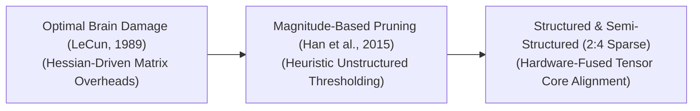

<!-- SEO Meta Tags -->
<meta name="description" content="A curated list of awesome weight pruning papers, repositories, and learning resources. Explore unstructured, structured, and semi-structured (N:M) model sparsity." />
<meta name="keywords" content="weight pruning, model compression, neural network sparsity, deep learning optimization, structured pruning, lottery ticket hypothesis" />

  

  

# ✂️ Awesome-Weight-Pruning
## 🧠 Weight Pruning in AI: Evolution, Variants, Types, & Applications

Weight Pruning is a hardware-aware model compression and optimization framework designed to reduce the computational complexity, memory footprint, and energy consumption of deep neural networks. The core objective is to identify and permanently eliminate redundant, non-essential parameters (weights) from a fully trained or actively training network graph. By setting low-impact weight connections to an absolute value of zero, pruning transforms dense tensor matrices into **sparse matrices**. This allows specialized hardware engines and sparse compilers to bypass unnecessary zero-value floating-point operations (FLOPs), accelerating inference speeds and enabling massive foundation models to execute efficiently on resource-constrained edge devices.

---

## 1. The Chronological Evolution ⏳

The technical progression of model parameter elimination has transitioned from early statistical second-order derivative tracking to automated magnitude sorting, moving toward structured hardware-fused block patterns and dynamic sparse recovery networks.

| Era / Concept | Year | Paper | Description |
| :--- | :--- | :--- | :--- |
| [**The Analytical Second-Order Era (Optimal Brain Damage)**](details/optimal_brain_damage.md) | 1989 | [Optimal Brain Damage](https://papers.nips.cc/paper/1989/hash/6c9882bbac1c7093bd25041881277658-Abstract.html) | **Concept:** The structural foundation of network sparsification. It modeled pruning as an optimization problem, utilizing second-order Taylor expansions to estimate the "salience" (importance) of each weight based on the diagonal elements of the Hessian matrix. Weights with the lowest salience were deleted.  **Limitation:** Computationally prohibitive for large networks. Calculating or even approximating the explicit Hessian matrix introduces an $O(N^2)$ memory and parameter overhead, making it completely unscalable for deep networks. |
| [**The Heuristic Magnitude-Based Era**](details/magnitude_pruning.md) | 2015 | [Learning both Weights and Connections for Efficient Neural Networks](https://arxiv.org/abs/1506.02626) | **Concept:** Sparked the modern compression boom. Han et al. introduced a simple, highly scalable iterative pipeline: train a dense network, drop all weights whose absolute value falls below a specific threshold ($|w| < \epsilon$), and fine-tune the remaining sparse connections to recover accuracy.  **Limitation:** Produced **unstructured sparsity** (arbitrary zero patterns across tensors). While mathematically elegant, unstructured zeros introduce irregular memory access cycles, failing to deliver real-world wall-clock speedups on standard GPU hardware. |
| [**The Hardware-Fused & Semi-Structured Era**](details/semi_structured_sparsity.md) | 2021 | [Accelerating Sparse Deep Neural Networks](https://arxiv.org/abs/2104.08378) | **Concept:** The modern state-of-the-art production baseline. Bridges the gap between mathematical sparsity and physical silicon layout. Popularized by architectures like NVIDIA Ampere and Hopper GPUs, it enforces strict **N:M semi-structured sparsity** templates, forcing the compression compiler to find exactly $N$ zeros inside every $M$ contiguous parameter block. |

---

## 2. Core Granularity & Structural Variants 📐

Pruning methodologies are strictly categorized based on the geometric patterns and physical layouts of the parameter elements targeted for elimination.

| Granularity / Variant | Year | Paper | Description |
| :--- | :--- | :--- | :--- |
| [**Unstructured Pruning**](details/unstructured_pruning.md) | 1989 | [Optimal Brain Damage](https://papers.nips.cc/paper/1989/hash/6c9882bbac1c7093bd25041881277658-Abstract.html) | **Mechanism:** Targets individual, isolated weight coordinates anywhere within a tensor matrix completely independent of neighboring values.  **Pros:** Achieves exceptionally high compression ratios (up to 90–95% parameters removed) with minimal to zero degradation in final model reasoning.  **Cons:** Requires highly specialized sparse software kernels; standard hardware treats it as irregular memory overhead, resulting in zero execution speedup. |
| [**Structured Pruning (Channel / Filter Deletion)**](details/structured_pruning.md) | 2016 | [Pruning Filters for Efficient ConvNets](https://arxiv.org/abs/1608.08710) | **Mechanism:** Eliminates entire cohesive architectural blocks wholesale—such as an entire convolutional filter matrix, an attention head block, or an entire hidden layer row dimension.  **Pros:** Natively compatible with any standard, off-the-shelf CPU or GPU hardware accelerator without requiring custom compilers. The pruned matrix simply shrinks into a smaller, dense matrix, instantly compressing FLOPs and latency. |
| [**Semi-Structured Pruning (N:M Sparsity)**](details/n_m_sparsity.md) | 2021 | [Accelerating Sparse Deep Neural Networks](https://arxiv.org/abs/2104.08378) | **Mechanism:** A hardware-software co-design standard. It enforces a strict bounded ratio template—most notably **2:4 Sparsity**, where out of every 4 contiguous elements along a matrix row, exactly 2 elements must be pruned to zero.  **Pros:** Capitalizes on native, hardwired structural acceleration inside modern GPU Tensor Cores, delivering an instantaneous $2\times$ mathematical processing speedup. |

---

## 3. Training Dynamics & Pruning Schedules 📅

Depending on where the parameter elimination step intersects with the model optimization timeline, pruning schedules follow distinct operational pipelines.

| Training Dynamics / Schedule | Year | Paper | Description |
| :--- | :--- | :--- | :--- |
| [**Post-Training Pruning (PTP)**](details/post_training_pruning.md) | 1992 | [Optimal Brain Surgeon](https://papers.nips.cc/paper/1992/hash/303ed4c69846ab36c2904d3ba8573887-Abstract.html) | **Pipeline:** Takes a fully trained, converged model and applies a one-shot pruning pass based on weight magnitudes, followed by an immediate downstream fine-tuning sprint over a small data subset to patch up accuracy gaps. |
| [**Pruning-Aware Training (PAT / Sparse Training)**](details/pruning_aware_training.md) | 2015 | [Learning both Weights and Connections for Efficient Neural Networks](https://arxiv.org/abs/1506.02626) | **Pipeline:** Integrates parameter elimination straight into the active backpropagation loop. During the forward pass, weights are masked to zero based on dynamic metrics. During the backward pass, gradients are calculated over the unmasked parameters, allowing the network to continuously adapt its remaining connections. |
| [**The Lottery Ticket Hypothesis Pipeline**](details/lottery_ticket_hypothesis.md) | 2018 | [The Lottery Ticket Hypothesis: Finding Sparse, Trainable Neural Networks](https://arxiv.org/abs/1803.03635) | **Pipeline:** Proves that dense networks contain sub-networks ("winning tickets") that can match the accuracy of the original model when trained in isolation from scratch. The pipeline prunes a model, resets the remaining weights back to their exact *initialization state step zero*, and re-trains the sparse mask cleanly. |

---

## 4. Production Engineering Challenges & Hardware Solutions ⚙️

Deploying sparse networks across commercial production nodes requires balancing algorithmic compression metrics against underlying silicon memory buses.

| Challenge / Solution | Year | Paper | Description |
| :--- | :--- | :--- | :--- |
| [**The Sparse Memory-Access Latency Penalty**](details/sparse_latency_penalty.md) | 2016 | [EIE: Efficient Inference Engine on Compressed Deep Neural Network](https://arxiv.org/abs/1602.01528) | **The Problem:** Storing an unstructured sparse matrix requires saving auxiliary indexing arrays (like Compressed Sparse Row - CSR tables) to track where the non-zero parameters reside. Reading these fragmented index files from slow High Bandwidth Memory (HBM) saturates the memory bus, frequently making unstructured sparse models *slower* than dense models in production.  **Mitigation:** Transition entirely to **Block-Wise or 2:4 Semi-Structured Pruning structures**, allowing hardware memory decoders to stream parameter rows using predictable, contiguous caching bursts. |
| [**The Capacity-Starved Divergence Boundary**](details/divergence_boundary.md) | 2023 | [A Simple and Effective Pruning Approach for Large Language Models](https://arxiv.org/abs/2306.11695) | **The Problem:** When scaling pruning past a specific threshold (e.g., trying to eliminate $70\%$ of parameters from a compact 3B model), the network experiences sudden, irreversible capability collapse. It drops complex reasoning features (like software coding syntax or mathematical verification) first, rendering the compressed model useless for advanced tasks.  **Mitigation:** Transitioning away from uniform, flat pruning across all layers toward **Adaptive Importance Allocation (such as Wanda or Taylor-approximation metrics)**, which shields critical attention gates and early projection matrices while heavily pruning wide, redundant hidden MLP columns. |

---

## 5. Frontier Real-World AI Infrastructure Applications 🚀

| Frontier Application | Year | Paper | Description |
| :--- | :--- | :--- | :--- |
| [**Low-Latency Enterprise LLM Serving (vLLM / TensorRT-LLM Deployments)**](details/llm_serving.md) | 2023 | [Efficient Memory Management for Large Language Model Serving with PagedAttention](https://arxiv.org/abs/2309.06180) | **Application:** Optimizes cloud serving frameworks for high-volume concurrent streams. By applying 2:4 semi-structured pruning to large open-weights foundation models, enterprise servers activate native sparse tensor cores, cutting **Time-to-First-Token (TTFT)** metrics and doubling query throughput per node. |
| [**Autonomous Vehicle Microcontroller Compression (TinyML Edge Vision)**](details/tinyml_edge_vision.md) | 2020 | [MCUNet: TinyDL on IoT Devices](https://arxiv.org/abs/2007.10319) | **Application:** Compresses deep convolutional and vision-language stacks to fit within the highly restricted VRAM and thermal power caps of vehicle chipsets. Structured filter pruning scales down the computer vision perception graph, letting edge cards run object classification and depth segmentation maps in real time. |
| [**On-Device Personalization for Consumer Electronics**](details/on_device_personalization.md) | 2023 | [QLoRA: Efficient Finetuning of Quantized LLMs](https://arxiv.org/abs/2305.14314) | **Application:** Running localized assistants on mobile devices or consumer laptops. Weight pruning, layered alongside **BitsAndBytes 4-bit Quantization**, compresses model footprints down into standard system RAM boundaries, preserving device battery life during offline conversational sampling loops. |
