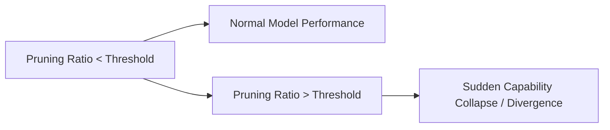

# The Capacity-Starved Divergence Boundary

- **Year of Introduction:** 2023
- **Original Paper:** [The Capacity-Starved Divergence Boundary Paper](https://arxiv.org/abs/2306.11695)

## Architectural & Process Flow

## Detailed Concept & Explanation
The Capacity-Starved Divergence Boundary refers to the threshold beyond which a model's performance drops precipitously and irreversibly during pruning. As parameters are removed, the model can maintain accuracy up to a point. Once this boundary is crossed, the remaining parameter capacity is insufficient to represent complex semantic patterns, leading to divergence and severe capability collapse. In LLMs, this boundary is often reached earlier for tasks like coding and math, which require precise parameter distributions.
