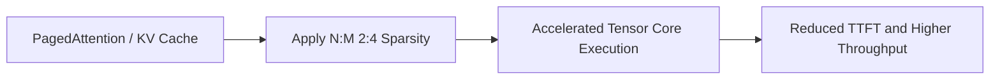

# Low-Latency Enterprise LLM Serving

- **Year of Introduction:** 2023
- **Original Paper:** [Low-Latency Enterprise LLM Serving Paper](https://arxiv.org/abs/2309.06180)

## Architectural & Process Flow

## Detailed Concept & Explanation
Low-latency enterprise LLM serving requires optimizing key performance metrics like Time-to-First-Token (TTFT) and throughput. Deploying pruned LLMs using frameworks like vLLM and TensorRT-LLM allows enterprises to scale their serving infrastructure. By integrating 2:4 structured sparsity with optimized memory management (such as PagedAttention), serving systems can bypass redundant weights, reducing memory consumption and improving real-world latency under high concurrent request volumes.
