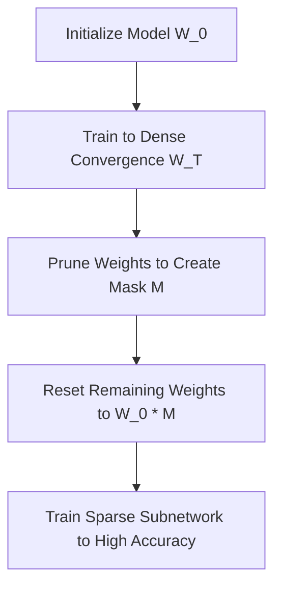

# The Lottery Ticket Hypothesis (LTH)

- **Year of Introduction:** 2018
- **Original Paper:** [The Lottery Ticket Hypothesis (LTH) Paper](https://arxiv.org/abs/1803.03635)

## Architectural & Process Flow

## Detailed Concept & Explanation
The Lottery Ticket Hypothesis, proposed by Jonathan Frankle and Michael Carbin in 2018, posits that a randomly initialized, dense neural network contains a subnetwork (a 'winning ticket') that can be trained in isolation to match the test accuracy of the original network in a similar number of steps. The process involves training the dense network, pruning it to find the sparse structure (the mask), resetting the remaining weights to their exact initialization values (at step zero), and retraining the sparse network. This finding challenges the conventional belief that over-parameterization is strictly necessary during the entire training process.
