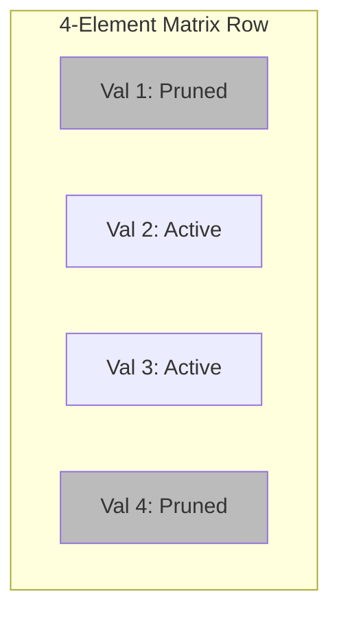

# N:M Sparsity

- **Year of Introduction:** 2021
- **Original Paper:** [N:M Sparsity Paper](https://arxiv.org/abs/2104.08378)

## Architectural & Process Flow

## Detailed Concept & Explanation
N:M Sparsity refers to a semi-structured pruning pattern where in every group of M contiguous elements, exactly N elements are pruned to zero. The most notable example is the 2:4 sparsity pattern supported by NVIDIA Ampere and Hopper architectures. It represents a sweet spot between unstructured pruning (high accuracy, low hardware friendliness) and structured pruning (low accuracy, high hardware friendliness). By keeping 2 elements active and zeroing out 2 elements in each 4-element block, the network maintains high representational capacity while enjoying hardware-accelerated execution.
