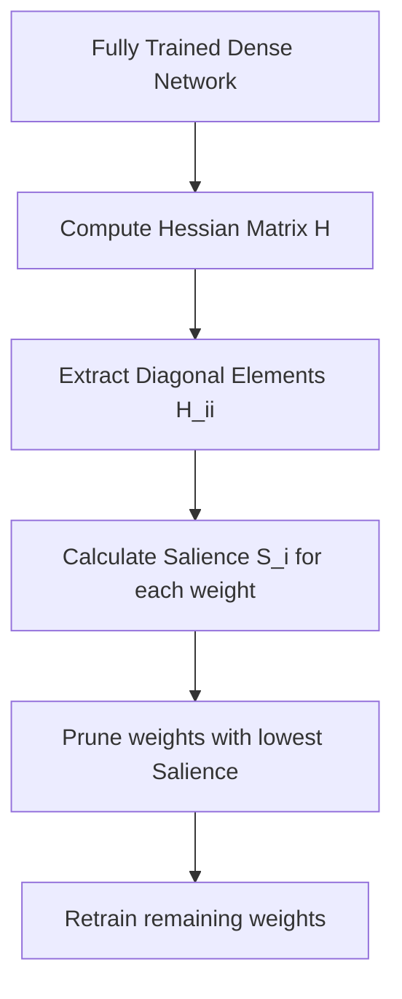

# Optimal Brain Damage (OBD)

- **Year of Introduction:** 1989
- **Original Paper:** [Optimal Brain Damage (OBD) Paper](https://papers.nips.cc/paper/1989/hash/6c9882bbac1c7093bd25041881277658-Abstract.html)

## Architectural & Process Flow

## Detailed Concept & Explanation
Optimal Brain Damage (OBD) was introduced by Yann LeCun, John S. Denker, and Sara A. Solla in 1989. It revolutionized the approach to network simplification by framing weight pruning as an optimization problem rather than a simple heuristic. The core idea is to estimate the change in the loss function when a parameter is removed using a second-order Taylor series expansion. By assuming the Hessian matrix is diagonal (to make computation feasible), OBD calculates a 'salience' value for each weight. Weights with the lowest salience are pruned, followed by retraining. While mathematically rigorous, computing the diagonal of the Hessian for modern neural networks with billions of parameters remains a significant computational bottleneck.
