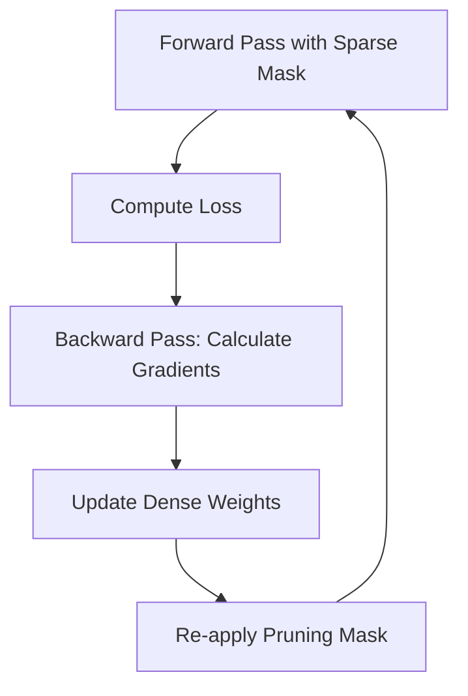

# Pruning-Aware Training (PAT)

- **Year of Introduction:** 2015
- **Original Paper:** [Pruning-Aware Training (PAT) Paper](https://arxiv.org/abs/1506.02626)

## Architectural & Process Flow

## Detailed Concept & Explanation
Pruning-Aware Training (PAT), also known as sparse training, integrates the pruning process into the model training loop. Instead of pruning a pre-trained model in a one-shot fashion, PAT continuously masks weights during the forward pass and updates the underlying dense or active sparse weights during the backward pass. This allows the model to dynamically redistribute weights and optimize the remaining connections to fit the sparsified architecture, yielding much higher accuracy at high compression ratios compared to post-training pruning.
