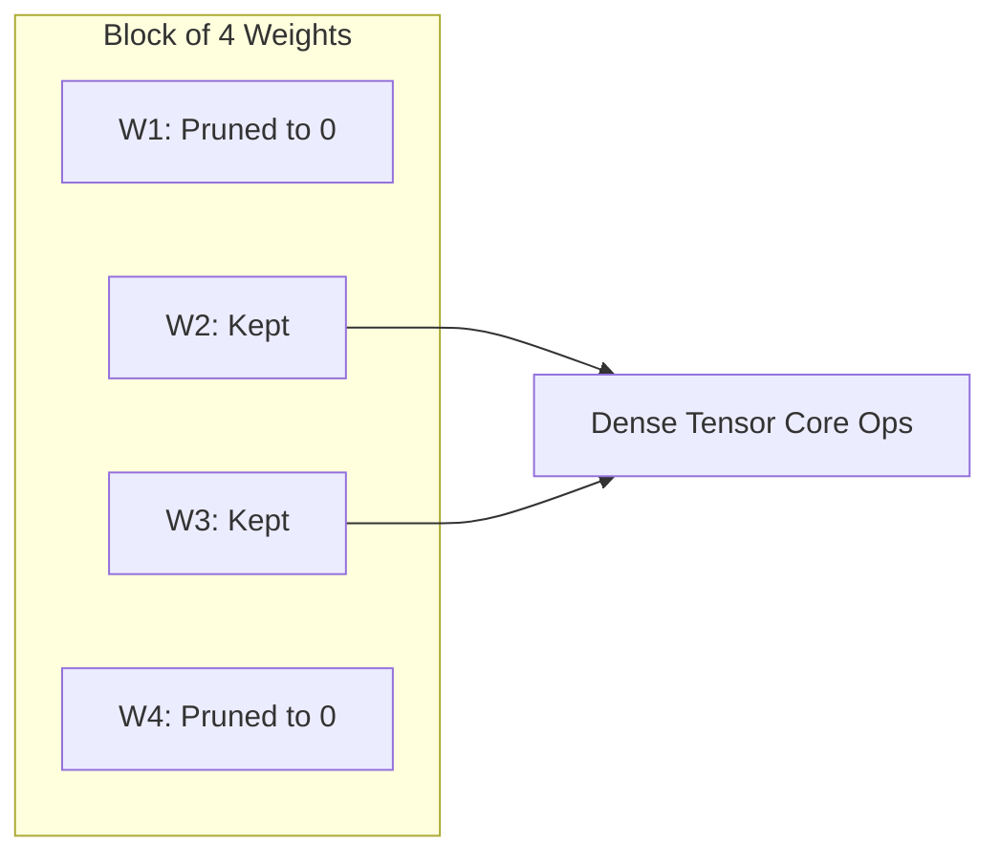

# Hardware-Fused & Semi-Structured Sparsity

- **Year of Introduction:** 2021
- **Original Paper:** [Hardware-Fused & Semi-Structured Sparsity Paper](https://arxiv.org/abs/2104.08378)

## Architectural & Process Flow

## Detailed Concept & Explanation
Hardware-Fused & Semi-Structured Sparsity represents a paradigm shift where hardware and software are co-designed for deep learning acceleration. Popularized by NVIDIA's Ampere architecture in 2020/2021, it enforces an N:M sparsity pattern (most commonly 2:4). For every block of 4 contiguous weights along a matrix row, exactly 2 must be zero. This rigid structure allows modern Tensor Cores to skip zero calculations via compressed index metadata, yielding a 2x throughput speedup without the irregular memory-access latency associated with unstructured pruning.
