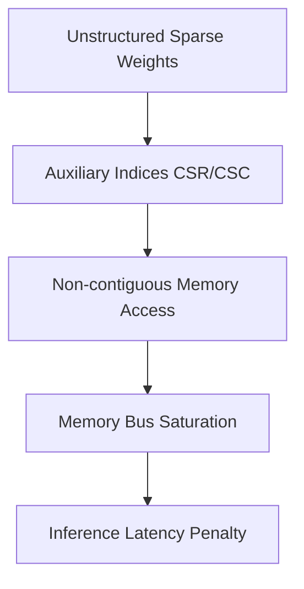

# The Sparse Memory-Access Latency Penalty

- **Year of Introduction:** 2016
- **Original Paper:** [The Sparse Memory-Access Latency Penalty Paper](https://arxiv.org/abs/1602.01528)

## Architectural & Process Flow

## Detailed Concept & Explanation
The Sparse Memory-Access Latency Penalty is a major bottleneck in deploying unstructured sparse networks on commodity hardware. To store a matrix with unstructured zeros, one must store both the non-zero values and their coordinate indices using formats like Compressed Sparse Row (CSR). Reading these indices leads to irregular, non-contiguous memory lookups. Since memory bandwidth is often the main bottleneck for inference (especially in LLMs), loading these index tables can make unstructured sparse inference slower than running the original dense model.
