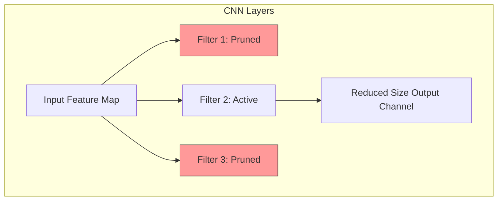

# Structured Pruning (Channel & Filter Deletion)

- **Year of Introduction:** 2016
- **Original Paper:** [Structured Pruning (Channel & Filter Deletion) Paper](https://arxiv.org/abs/1608.08710)

## Architectural & Process Flow

## Detailed Concept & Explanation
Structured pruning eliminates entire structural components of a neural network, such as channels, filters, attention heads, or entire layers. Because it removes entire dimensions from weight matrices, the resulting network remains dense but smaller. This allows the pruned model to run directly on standard hardware (CPUs, GPUs, TPUs) without custom sparse runtimes or compilers, yielding immediate out-of-the-box speedups and memory reductions. However, structured pruning typically incurs higher accuracy drops at high compression ratios compared to unstructured pruning.
