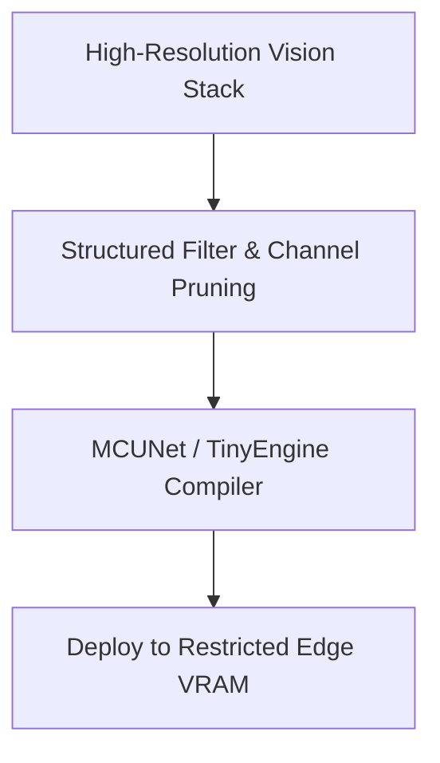

# Autonomous Vehicle Microcontroller Compression (TinyML)

- **Year of Introduction:** 2020
- **Original Paper:** [Autonomous Vehicle Microcontroller Compression (TinyML) Paper](https://arxiv.org/abs/2007.10319)

## Architectural & Process Flow

## Detailed Concept & Explanation
Edge vision systems on autonomous vehicles and microcontrollers require real-time processing under strict thermal and power envelopes. Structured channel pruning is a critical tool for TinyML deployments, as it reduces both model parameter count and intermediate feature map sizes. This allows complex convolutional networks and vision-language stacks to fit directly into the fast static RAM of microcontrollers and low-power edge accelerators without compromising safety-critical detection latencies.
