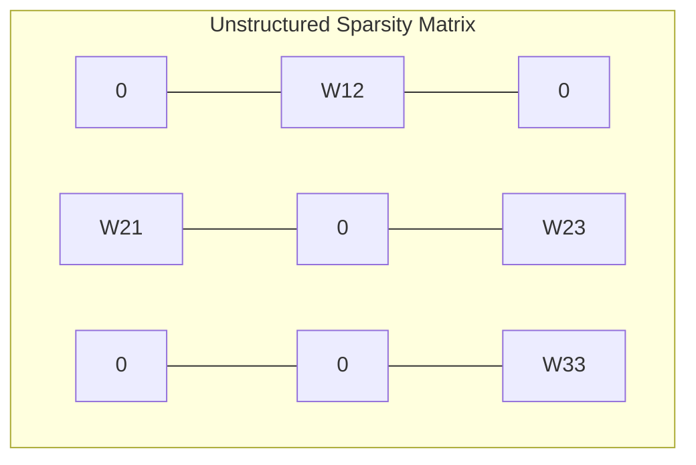

# Unstructured Pruning

- **Year of Introduction:** 1989
- **Original Paper:** [Unstructured Pruning Paper](https://papers.nips.cc/paper/1989/hash/6c9882bbac1c7093bd25041881277658-Abstract.html)

## Architectural & Process Flow

## Detailed Concept & Explanation
Unstructured pruning removes individual weights from a neural network based on their importance (e.g., magnitude) without any structural constraints. While unstructured pruning can achieve extreme compression rates (often removing 90%+ of weights with virtually no accuracy loss), it creates sparse matrices with arbitrary zero patterns. Standard CPUs and GPUs are optimized for dense matrix multiplication and struggle to accelerate unstructured sparse matrices, often resulting in high memory-access latency and no real-world speedup unless specialized sparse compilers or runtimes are used.
